<a href="https://bhanuprasadpalella.vercel.app"><picture><source media="(prefers-color-scheme: dark)" srcset="assets/hero-dark.svg"></picture></a>

  <a href="https://bhanuprasadpalella.vercel.app"><b>Portfolio</b></a> &nbsp;·&nbsp;
  <a href="https://bhanuprasadpalella.vercel.app/resume">Résumé</a> &nbsp;·&nbsp;
  <a href="https://www.linkedin.com/in/bhanuprasadpalella">LinkedIn</a> &nbsp;·&nbsp;
  <a href="mailto:bhanuprasadpalella@gmail.com">bhanuprasadpalella@gmail.com</a>

 

<picture><source media="(prefers-color-scheme: dark)" srcset="assets/head-about-dark.svg">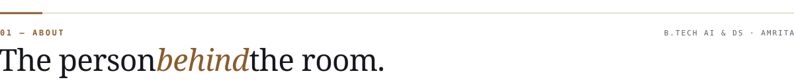</picture>

I'm **Bhanu** — a B.Tech student in Artificial Intelligence & Data Science at **Amrita Vishwa Vidyapeetham**, Coimbatore (CGPA 8.13, 2025 – 2029).

I like work that crosses from software into the physical world: a React app talking to a FastAPI model, an ESP32 robot serving its own dashboard, a 3D room you can walk through in the browser. Right now I'm shipping full-stack products, researching graph and reinforcement learning for sensor networks, and building robots for disaster response.

> **Open to** internships, research collaborations and ambitious side projects — the fastest way to reach me is [email](mailto:bhanuprasadpalella@gmail.com).

 

<picture><source media="(prefers-color-scheme: dark)" srcset="assets/head-work-dark.svg">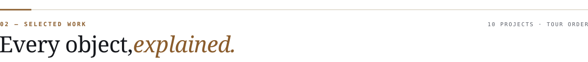</picture>

<a href="https://bhanuprasadpalella.vercel.app/work/vaultsphere"><picture><source media="(prefers-color-scheme: dark)" srcset="assets/card-01-dark.svg">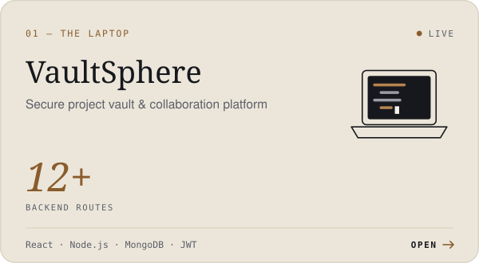</picture></a>
<a href="https://bhanuprasadpalella.vercel.app/work/protein-structure"><picture><source media="(prefers-color-scheme: dark)" srcset="assets/card-02-dark.svg">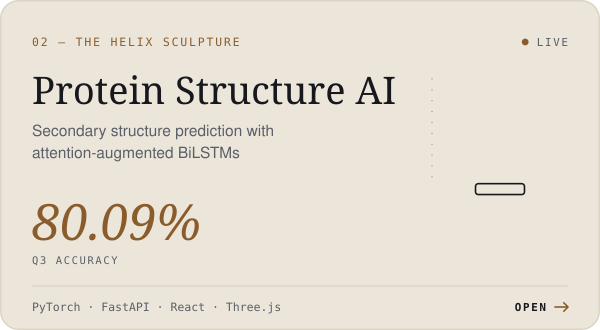</picture></a>
<a href="https://bhanuprasadpalella.vercel.app/work/rescuebot"><picture><source media="(prefers-color-scheme: dark)" srcset="assets/card-03-dark.svg">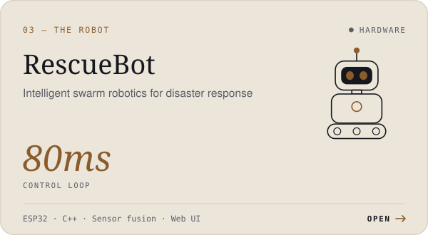</picture></a>
<a href="https://bhanuprasadpalella.vercel.app/work/swarmbot"><picture><source media="(prefers-color-scheme: dark)" srcset="assets/card-04-dark.svg">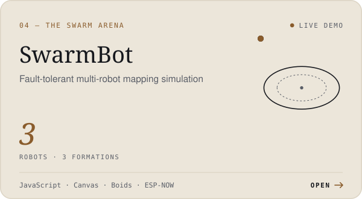</picture></a>
<a href="https://bhanuprasadpalella.vercel.app/work/adaptive-pso"><picture><source media="(prefers-color-scheme: dark)" srcset="assets/card-05-dark.svg">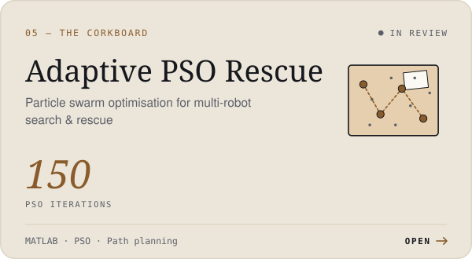</picture></a>
<a href="https://bhanuprasadpalella.vercel.app/work/mission-aware-sdr"><picture><source media="(prefers-color-scheme: dark)" srcset="assets/card-06-dark.svg"></picture></a>
<a href="https://bhanuprasadpalella.vercel.app/work/gnn-rl-scheduling"><picture><source media="(prefers-color-scheme: dark)" srcset="assets/card-07-dark.svg">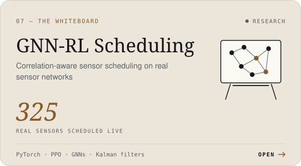</picture></a>
<a href="https://bhanuprasadpalella.vercel.app/work/complaint-intelligence"><picture><source media="(prefers-color-scheme: dark)" srcset="assets/card-08-dark.svg">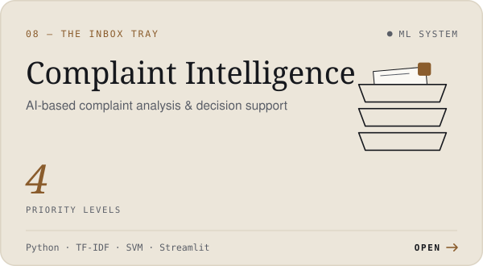</picture></a>
<a href="https://bhanuprasadpalella.vercel.app/work/fractallab-flockhunt"><picture><source media="(prefers-color-scheme: dark)" srcset="assets/card-09-dark.svg">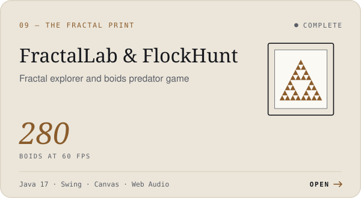</picture></a>
<a href="https://bhanuprasadpalella.vercel.app"><picture><source media="(prefers-color-scheme: dark)" srcset="assets/card-10-dark.svg">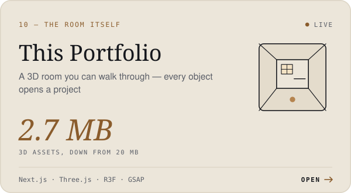</picture></a>

**Live** — [VaultSphere](https://vaultsphere.online) · [Protein Structure AI](https://protein-secondary-structure-fronten.vercel.app) · [this portfolio](https://bhanuprasadpalella.vercel.app)
&nbsp;&nbsp;**Code** — [Portfolio](https://github.com/BhanuPrasadPalella-01/Portfolio) · [protein-ss-frontend](https://github.com/BhanuPrasadPalella-01/protein-ss-frontend) · [protein-ss-backend](https://github.com/BhanuPrasadPalella-01/protein-ss-backend) · [gnn-aoi-scheduler](https://github.com/BhanuPrasadPalella-01/gnn-aoi-scheduler)
 **Also built** — a 3D fly-through portfolio for Gullanki Bhagya Lakshmi → [gullankisiri.vercel.app](https://gullankisiri.vercel.app)

 

<picture><source media="(prefers-color-scheme: dark)" srcset="assets/head-toolkit-dark.svg">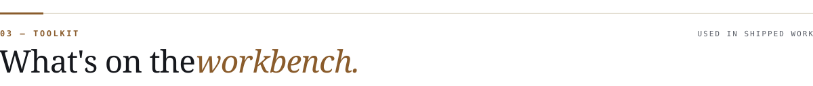</picture>

<picture><source media="(prefers-color-scheme: dark)" srcset="assets/toolkit-dark.svg">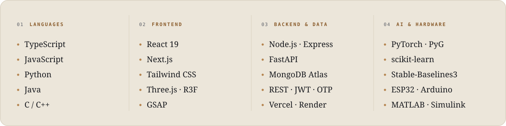</picture>

 

<picture><source media="(prefers-color-scheme: dark)" srcset="assets/head-beyond-dark.svg"></picture>

| | |
| :-- | :-- |
| **Siemens** · Operations Industrial Engineer Job Simulation · Forage, Oct 2026 | [certificate ↗](https://bhanuprasadpalella.vercel.app/certificates/siemens-operations-industrial-engineer.pdf) |
| **Deloitte** · Data Analytics Job Simulation · Forage, Aug 2026 | [certificate ↗](https://bhanuprasadpalella.vercel.app/certificates/deloitte-data-analytics.pdf) |
| **TATA** · GenAI Powered Data Analytics Job Simulation · Forage, Aug 2026 | [certificate ↗](https://bhanuprasadpalella.vercel.app/certificates/tata-genai-data-analytics.pdf) |
| **National Service Scheme (NSS)** · volunteer since my first year — many camps, many early mornings | 2025 – now |

 

<a href="https://bhanuprasadpalella.vercel.app"><picture><source media="(prefers-color-scheme: dark)" srcset="assets/signoff-dark.svg">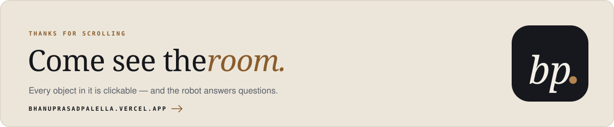</picture></a>

Artwork drawn by <code>build/make.py</code> in the portfolio's own type (Fraunces, Inter, JetBrains Mono) and colours — paper, ink and one bronze accent.
