<div align="center">

<picture>
  <source media="(prefers-color-scheme: dark)" srcset="assets/banner-dark.svg">
  <source media="(prefers-color-scheme: light)" srcset="assets/banner-light.svg">
  
</picture>

<br><br>

<a href="https://bhanuprasadpalella.vercel.app"></a>
<a href="https://www.linkedin.com/in/bhanuprasadpalella"></a>
<a href="mailto:bhanuprasadpalella@gmail.com"></a>
<a href="https://bhanuprasadpalella.vercel.app/resume"></a>

<br>

<code>[ whoami ]</code> · <code>[ top -p projects ]</code> · <code>[ ls ~/stack ]</code> · <code>[ cat certs ]</code> · <code>[ journalctl ]</code>

</div>

---

### `$ systemctl status bhanu`

<!-- STATUS:START -->
```text
┌─ SYSTEM STATUS ──────────────────────────────────┐
│ ● ONLINE  —  rescuebot.service active (running)  │
│                                                  │
│ public repos      5                              │
│ stars             0                              │
│ followers         0                              │
│ contributions     101 (12mo)                     │
│ streak            7 days                         │
│                                                  │
│ last push                                        │
│ └── BhanuPrasadPalella-01 · 0 min ago            │
└──────────────────────────────────────────────────┘
```
<!-- STATUS:END -->

### `$ whoami`

```yaml
name:      Bhanu Prasad Palella
role:      Full-stack developer · AI / ML · robotics
studying:  B.Tech, Artificial Intelligence & Data Science (CPS)
at:        Amrita Vishwa Vidyapeetham, Coimbatore · 2025 – 2029 · CGPA 8.13
building:  production web apps, deep-learning models and robots that leave the screen
off-duty:  NSS volunteer since first year — many camps, many early mornings
open-to:   internships · research collaborations · ambitious side projects
```

> I like work that crosses the line between software and the physical world:
> a React app talking to a FastAPI model, an ESP32 robot serving its own dashboard,
> a 3D room you can walk through in the browser.

### `$ top -p projects`

<!-- TOP:START -->
```text
┌─ top -p projects ────────────────────────────────┐
│ PID  PROJECT      STATUS    SIGNAL               │
│                                                  │
│ 001  VaultSphere  LIVE      ············ private │
│ 002  Portfolio    LIVE      ▓▓▓▓▓▓▓▓░░░░ 12      │
│ 003  ProteinAI    LIVE      ▓▓▓▓▓▓▓▓▓▓▓▓ 18      │
│ 004  GNN-RL       RESEARCH  ▓░░░░░░░░░░░ 1       │
│ 005  RescueBot    HARDWARE  ············ private │
│ 006  SwarmBot     DEMO      ············ private │
│ 007  AdaptivePSO  REVIEW    ············ private │
│ 008  MissionSDR   RESEARCH  ············ private │
│ 009  Complaints   ML        ············ private │
│ 010  FractalLab   DONE      ············ private │
│                                                  │
│ signal = commits in the last 30 days (peak 18)   │
└──────────────────────────────────────────────────┘
```
<!-- TOP:END -->

| module | status | what it is | links |
| :-- | :-- | :-- | :-- |
| **VaultSphere** | 🟢 live | Secure project vault: React + admin portal, Express REST API (12+ routes), JWT + OTP, roles, Groq AI file analysis, 5-language i18n | [LIVE](https://vaultsphere.online) · [CASE](https://bhanuprasadpalella.vercel.app/work/vaultsphere) |
| **3D Portfolio** | 🟢 live | Next.js + Three.js room you can explore — scroll camera, clickable projects, robot chat, day/night lighting | [LIVE](https://bhanuprasadpalella.vercel.app) · [CODE](https://github.com/BhanuPrasadPalella-01/Portfolio) |
| **Protein Structure AI** | 🟢 live | Attention-augmented BiLSTM, **80.09% Q3** (from 68.73%), FastAPI backend, React front end | [LIVE](https://protein-secondary-structure-fronten.vercel.app) · [FRONT](https://github.com/BhanuPrasadPalella-01/protein-ss-frontend) · [BACK](https://github.com/BhanuPrasadPalella-01/protein-ss-backend) |
| **GNN-RL Scheduling** | 🔬 research | GraphSAGE + PPO sensor scheduling on real sensor networks — 44% lower prediction error | [CODE](https://github.com/BhanuPrasadPalella-01/gnn-aoi-scheduler) · [CASE](https://bhanuprasadpalella.vercel.app/work/gnn-rl-scheduling) |
| **RescueBot** | 🛠 hardware | ESP32 disaster-response robot: 6-state controller, ToF / PIR / radar / IMU, live Wi-Fi dashboard | [CASE](https://bhanuprasadpalella.vercel.app/work/rescuebot) |
| **SwarmBot** | 🟢 demo | Fault-tolerant multi-robot mapping simulation | [CASE](https://bhanuprasadpalella.vercel.app/work/swarmbot) |
| **Adaptive PSO Rescue** | 📄 review | Particle swarm optimisation for collision-free multi-robot search & rescue | [CASE](https://bhanuprasadpalella.vercel.app/work/adaptive-pso) |
| **Mission-Aware SDR** | 🔬 research | Continual-learning packet scheduler for emergency networks (GNU Radio) | [CASE](https://bhanuprasadpalella.vercel.app/work/mission-aware-sdr) |
| **Complaint Intelligence** | 🧠 ML | TF-IDF + SVM complaint triage: category, sentiment, urgency, next action | [CASE](https://bhanuprasadpalella.vercel.app/work/complaint-intelligence) |
| **FractalLab & FlockHunt** | ✅ done | Fractal explorer and a boids predator game | [CASE](https://bhanuprasadpalella.vercel.app/work/fractallab-flockhunt) |
| **Gullanki Bhagya Lakshmi — 3D portfolio** | 🟢 live | Scroll-driven 3D fly-through with a rover model, themes, filters and a non-WebGL fallback | [LIVE](https://gullankisiri.vercel.app) |

### `$ ls ~/stack`

<p>


<br>


<br>


<br>


</p>

### `$ cat certs`

```text
[✓] Siemens   Operations Industrial Engineer Job Simulation   Forage · Oct 2026
[✓] Deloitte  Data Analytics Job Simulation                   Forage · Aug 2026
[✓] TATA      GenAI Powered Data Analytics Job Simulation     Forage · Aug 2026
```
<sub>PDFs: [Siemens](https://bhanuprasadpalella.vercel.app/certificates/siemens-operations-industrial-engineer.pdf) · [Deloitte](https://bhanuprasadpalella.vercel.app/certificates/deloitte-data-analytics.pdf) · [TATA](https://bhanuprasadpalella.vercel.app/certificates/tata-genai-data-analytics.pdf)</sub>

### `$ journalctl -u bhanu --since today`

<!-- FEED:START -->
```text
[06 Oct, 21:12] create   gnn-aoi-scheduler · branch main
[06 Oct, 20:34] push     protein-ss-frontend · 1 commit
[06 Oct, 20:34] push     protein-ss-backend · 1 commit
[06 Oct, 20:33] push     Portfolio · 1 commit
[04 Oct, 23:06] push     Portfolio · 1 commit
[04 Oct, 14:09] push     Portfolio · 1 commit
```
<!-- FEED:END -->

<picture>
  <source media="(prefers-color-scheme: dark)" srcset="https://raw.githubusercontent.com/BhanuPrasadPalella-01/BhanuPrasadPalella-01/output/snake-dark.svg">
  <source media="(prefers-color-scheme: light)" srcset="https://raw.githubusercontent.com/BhanuPrasadPalella-01/BhanuPrasadPalella-01/output/snake.svg">
  
</picture>

---

<div align="center">

<code>bhanu@amrita:~$ exit</code> — thanks for stopping by. The room is open at [bhanuprasadpalella.vercel.app](https://bhanuprasadpalella.vercel.app).

<!-- UPDATED:START -->
<sub>⟳ this README rebuilds itself every 6 hours · last run 07 Oct, 11:37 IST</sub>
<!-- UPDATED:END -->

</div>
